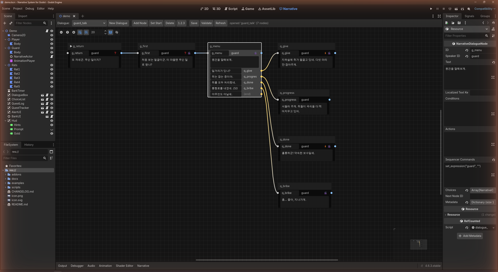
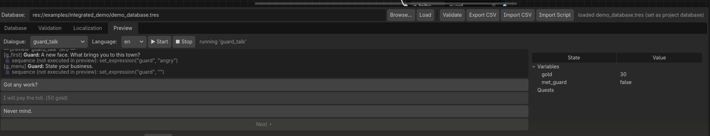
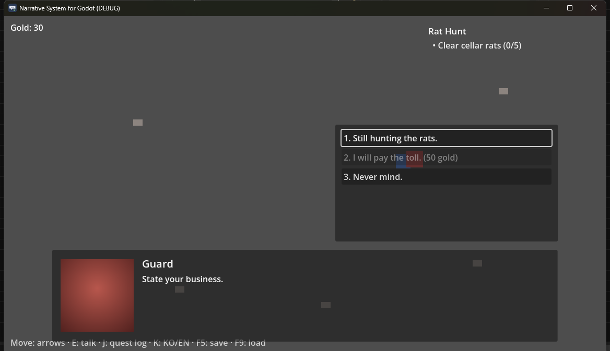
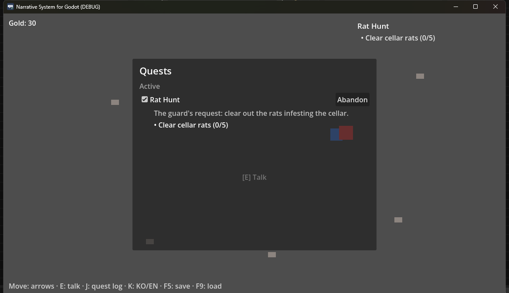
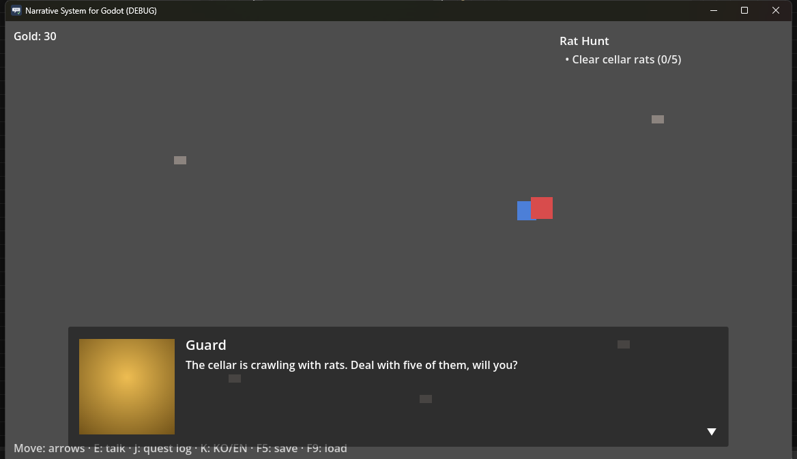

# Narrative System for Godot

[](https://godotengine.org)
[](https://github.com/yskim3271/godot-narrative-system/tags)
[](addons/narrative_system/LICENSE)

**All-in-one narrative system addon for Godot 4** — branching dialogue with
choices and conditions, quests (with log/tracker UI), save/load, localization,
barks, alerts, a cutscene sequencer, and authoring/validation tools in a
single package. Aims at the position "Dialogue System for Unity" holds,
natively in Godot. Pure GDScript, zero external dependencies, MIT.


*The "Narrative" main-screen tab: dialogue graph with inline editing
(speaker, text, node renames with link retargeting, choice text/targets),
full undo/redo, validation, and per-choice output ports.*

## Why this addon

Most Godot narrative addons solve **one** slice well — dialogue *or* quests
*or* saving. This one ships the whole loop and wires the pieces together:

| | Typical dialogue addons | Typical quest addons | **Narrative System** |
|---|---|---|---|
| Branching dialogue + conditions/variables | ✓ | ✗ | ✓ |
| Quests + log/tracker UI | ✗ | ✓ (not dialogue-aware) | ✓ — **start/progress/complete quests directly from dialogue actions** |
| Integrated save/load | partial | partial | ✓ versioned JSON + schema migrations |
| Barks / alerts | ✗ | ✗ | ✓ 2D & 3D speech bubbles, alert queue |
| Cutscene sequencer | partial | ✗ | ✓ parallel scheduling, extensible commands |
| Static validation tooling | ✗ | ✗ | ✓ editor panel + headless CLI |

Design principles:

- **Resource-native** — every piece of data is a `.tres` you edit in the
  Inspector; VCS-friendly, no opaque databases.
- **A safe DSL instead of `eval`** — conditions, actions and sequencer lines
  go through a hand-written lexer/parser/evaluator. No arbitrary code
  execution; game functions are whitelist-registered.
- **Signal-first loose coupling** — game code subscribes to the `Narrative`
  facade's signals. Every bundled UI is a replaceable reference
  implementation built on the same public API.
- **Headless-testable** — the entire runtime runs without UI; the repo ships
  252 tests, a happy-path zero-error gate and a database validation CLI.
- **Human-readable saves** — plain JSON, atomic writes with backup rotation,
  corruption quarantine, schema migrations.

## Features

- **Branching dialogue**: speaker/text nodes, conditional skips, choices
  (hidden or grayed-out when locked), re-entrant signal-safe runner,
  `has_seen()` first-meeting variations.
- **Graph editor**: a "Narrative" main-screen tab — node canvas with inline
  editing, node id renames that retarget every link, full undo/redo,
  auto-layout, choice auto-numbering.
- **Bottom panel tooling**: database overview, validation with
  **double-click-to-focus** (jumps the graph to the offending node and opens
  it in the Inspector), a per-locale **translation coverage report**, and an
  in-editor **dialogue preview** (sandboxed playback with live variable/quest
  state — authoring resources are never touched).
- **Text authoring format (.ndlg)**: writer-friendly line-based scripts with
  atomic import and round-trip export, plus inline `[var=x]` markup with
  editor shortcuts and BBCode pass-through.
- **Quests**: prerequisites, objectives with clamped progress and
  **auto-complete conditions**, reward actions, **abandon & repeatable
  quests** with completion tracking, categories, quest log + tracker UI.
- **Sequencer (cutscenes)**: runs alongside dialogue lines, cancellable by
  input. Sequential lines plus Unity-DS-style parallel scheduling —
  `cmd() @ 1.5`, `cmd() @ message("ready")`, `cmd() -> "done"`. 16 built-in
  commands (animation, audio, 2D/3D camera, actors), custom command
  registration.
- **Save/load**: versioned plain-JSON saves, atomic writes, corruption
  isolation, migrations, dialogue-position resume (presentation-only replay).
- **Localization**: layered resolution (current language → inline text →
  fallback), convention keys, CSV round-trip, instant runtime language
  switching.
- **Barks & alerts**: speech bubbles above 2D and 3D actors, alert queue.
- **Validator**: static analysis of the whole database (broken links,
  unknown ids, DSL parse errors, unreachable nodes, missing localization
  keys, …) as an editor panel and a CI-friendly CLI.

## More screenshots

*In-editor dialogue preview — sandboxed playback with choices, quest/alert
transcript and a live state view:*



| Numbered & condition-locked choices, quest tracker | Quest log with abandon + objectives |
|---|---|
|  |  |


*Accepting a quest from dialogue: alert queue, tracker HUD update and a
sequencer cutscene (expression change, camera pan) — all driven by data.*

## Installation

1. Copy `addons/narrative_system/` into your project (installing from the
   [Godot Asset Library](https://godotengine.org/asset-library/) does this
   for you).
2. Enable **Project Settings → Plugins → Narrative System** — this registers
   the `Narrative` autoload and project settings.
3. Point the `narrative_system/database_path` project setting at your
   `NarrativeDatabase` resource (the bottom **Narrative** panel's *Load*
   button does this automatically).

The runtime also works without the editor plugin: register
`runtime/narrative.gd` as an autoload named `Narrative` manually.

## Quick start

```gdscript
# Scene: add ui/dialogue_box.tscn and ui/choice_list.tscn instances, then:
Narrative.start_dialogue("guard_talk")

Narrative.dialogue_ended.connect(func(id): player.can_move = true)
Narrative.quest_updated.connect(func(id): print("quest changed: ", id))
```

Everything goes through the `Narrative` facade — signals for presentation,
methods for control (`advance()`, `select_choice()`, `start_quest()`,
`save_game()`, `set_language()`, `bark()`, `play_sequence()`, …).

## Demos (5 runnable projects)

Clone this repo, open it in Godot and press ▶ — the main scene is the
integrated demo. Each demo has its own README:

| Demo | Shows |
|---|---|
| [basic_dialogue_demo](examples/basic_dialogue_demo/README.md) | Minimal setup — code-built database, linear dialogue |
| [branching_choice_demo](examples/branching_choice_demo/README.md) | Choices, conditions, disabled options — authored in **.ndlg** |
| [quest_demo](examples/quest_demo/README.md) | Full quest cycle: accept → progress → complete, log/tracker |
| [localization_cutscene_demo](examples/localization_cutscene_demo/README.md) | Runtime ko/en switching, sequencer cutscene, barks |
| [integrated_demo](examples/integrated_demo/README.md) | Everything together, including save/load mid-choice |

## Documentation

The English [package README](addons/narrative_system/README.md) covers the
essentials, and all source code is commented in English. The full per-feature
guides under [docs/](docs/) are currently written in **Korean** (translation
is on the roadmap) — machine translation works well on them, and the API
surface itself is documented in code:

| Document (Korean) | Contents |
|---|---|
| [getting_started.md](docs/getting_started.md) | Install paths, your first dialogue in 10 minutes |
| [dialogue_authoring.md](docs/dialogue_authoring.md) | Authoring workflow, branching patterns, pitfalls |
| [graph_editor.md](docs/graph_editor.md) | Node graph editor (main-screen tab, undo/redo) |
| [text_script.md](docs/text_script.md) | The .ndlg text authoring format |
| [dsl.md](docs/dsl.md) | Condition/action mini-language grammar & semantics |
| [quest_system.md](docs/quest_system.md) | Quest states, objectives, rewards, UI |
| [save_load.md](docs/save_load.md) · [save_format.md](docs/save_format.md) | Usage · JSON schema & migrations |
| [localization.md](docs/localization.md) | Key conventions, CSV round-trip, language switching |
| [sequencer.md](docs/sequencer.md) | Built-in command reference, custom commands |
| [extending.md](docs/extending.md) | Registering game functions/commands, custom UIs |
| [api_reference.md](docs/api_reference.md) | Complete facade API & signals |
| [architecture.md](docs/architecture.md) · [signals.md](docs/signals.md) | Internal design |
| [known_limitations.md](docs/known_limitations.md) · [roadmap.md](docs/roadmap.md) | Limits and what's next |

## Running the tests

```powershell
.\scripts\run_tests.ps1            # import -> 252 unit/integration tests ->
                                   # happy-path purity -> DB validation -> demo boots
.\scripts\run_tests.ps1 -Filter lexer
```

The suite needs a Godot 4.4+ console binary (`-GodotExe` to point elsewhere).
Current status: [docs/test_report.md](docs/test_report.md).

## Repository layout

```
addons/narrative_system/   # the addon itself (copying this folder = installing)
  runtime/                 #   facade, dialogue runner, quests, saves, l10n, sequencer (+dsl/)
  resources/               #   data model (NarrativeDatabase and 9 more)
  ui/                      #   7 reference UIs (.tscn/.gd)
  editor/                  #   graph editor + bottom panel (@tool)
  validation/              #   static validator + CLI (editor-independent)
  import_export/           #   localization CSV + .ndlg parser
  tests/                   #   headless test harness + 252 tests (excluded from the package)
examples/                  # 5 demo projects (run from this repo)
docs/                      # guides, design notes, per-phase reports (Korean)
```

## License

[MIT](addons/narrative_system/LICENSE) © Yunsik Kim
